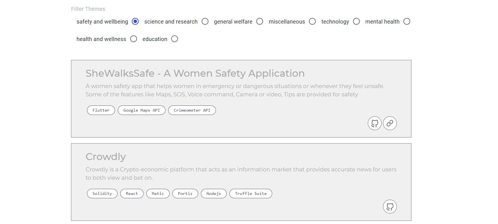

# Hackofiesta
- [Project video](https://www.youtube.com/watch?v=llKI-qmbowA&t=6s)
- [Hosted frontend link](https://tanishabisht.github.io/CaffeineOverflow-FrontEnd)
- [Hosted backend link](https://hacko-backend-apis.herokuapp.com/)
- [Backend repo](https://github.com/Addii45/CaffieneOverflow)

## How to Install
You must have the following tools installed in your PC
1. Node Packange Manager
2. COde Editor (preferred VSC)

Guidelines to run the project
1. Pull the repo in your local
2. In your command line, write the code `npm install` to install all the dependancies
3. To run in your local machine, write the code `npm start`

Run the backend in Linux/macOS, as we need turicreate that run in Linux/macOS only

## What is inside?

 

